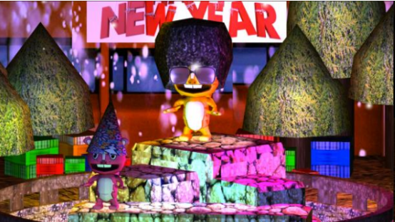
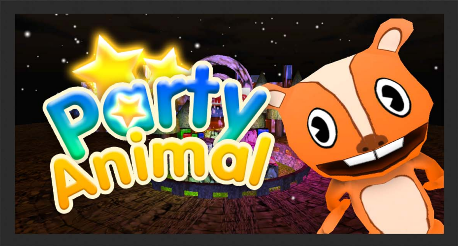

# Animal Party
### About Project
This game has won a Photon Game Jam Award 2013. The competitions
only have 24 hours to finish the game. It has to be Online Multiplayer
through the Photon Cloud system. The game features multiplayer system
where players can join and dance to match the AI in the game. The person
that dance according to the AI the most will win the game. Players can also
perform a distraction scream to another players.

### My Responsibilities
My role in this project is developing the bot and creating Sync
information from players who enter the room so they can play Multiplayer.

### Development Duration
24 hours

### Development Tools
- Unity
- Photon Cloud

